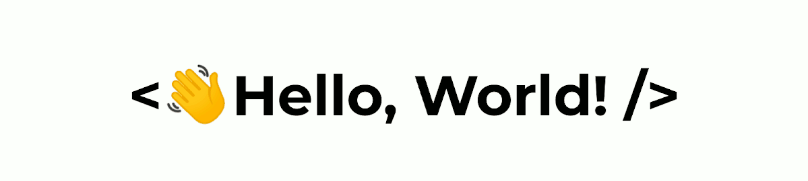

    

### 
I'm Kadin, a Canadian Software Developer 🇨🇦

### 
Currently studying Computer Science @ UCalgary

## Contact 🥷

    
    
    

    
## My Skill Set ⚡️

    
    
    

## Stats 📈

    
    

  
<!---
kadinsayani/kadinsayani is a ✨ special ✨ repository because its `README.md` (this file) appears on your GitHub profile.
You can click the Preview link to take a look at your changes.
https://dev.to/envoy_/150-badges-for-github-pnk#terminal
--->
